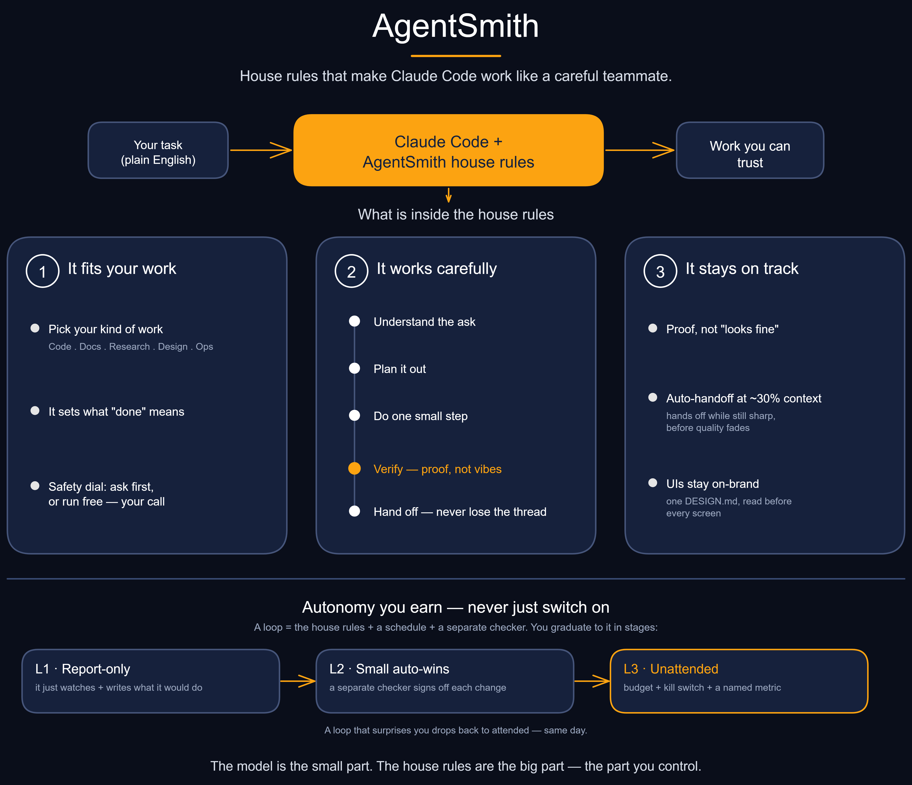

# AgentSmith — the universal agent harness

<p align="center">
  
</p>

Vibe coding gets you a working demo. **AI-assisted engineering** is what keeps it standing once
customers arrive, the product changes, or another engineer has to touch it. Agentsmith is that
second layer — a portable, battle-tested operating system for **Claude Code and OpenAI Codex**
(and any agent that reads a `CLAUDE.md` / `AGENTS.md` / `GEMINI.md`). Drop it on any machine, pick the kind of work
you're doing, and the same disciplined core adapts to it — **software, devops/setup, marketing &
outreach, document creation, data crunching, research, design, and general admin.**

> **The agent is the model plus the harness.** The model is ~10% of the outcome; the harness —
> the rules, tools, memory, guardrails, and feedback loops around it — is the other ~90%, and
> it's the part you control. This repo is that 90%, generalized and reusable. (The reasoning is in
> [`docs/01-harness-philosophy.md`](docs/01-harness-philosophy.md); the public work these ideas
> build on is credited in full under [principles & influences](docs/18-influences.md).)

It didn't come from a whiteboard. It grew over ~6 months of real, autonomous work — data
crunching, marketing outreach, dozens of smaller projects, and one software product still in
active development after half a year — across hundreds of sessions. What's here is roughly its
**fifth iteration**: scrubbed of all project specifics and split into a universal core +
swappable work-type profiles.

---

## How it works in 4 steps

1. **Install once.** `setup.sh` assembles a deliberately lean `CLAUDE.md`, `AGENTS.md`, or both
   from the universal
   **core** (the rules that never change) plus the **profile(s)** for the kind of work you're doing.
   Install the core globally once, then add a thin profile per project. Just run
   `./setup.sh` (with no flags it's the wizard) — it builds the command for you and shows it
   before running.
2. **Work one unit at a time.** Each session takes a single tracked item and runs it
   **plan → implement → verify → ship** with real autonomy — the agent decides routing and scope,
   and only pauses for the few things that genuinely need a human (a missing credential, an external
   surprise).
3. **Verify before "done."** Nothing ships on vibes. `verify.sh` runs *your* project's real checks,
   bug fixes need a failing test first (prove-it), and review gates catch what tests can't — evidence
   before assertion, every time.
4. **Hand off early, and improve the harness.** When you say "handoff," the agent safe-states and
   writes a recall prompt so the next session resumes clean. Claude can also provide a best-effort
   nudge around ~25–30% context used; Codex does not install that status-line-dependent nudge. And when
   something goes wrong, the habit is to **fix the system, not just the symptom** — sharpen a rule,
   add a gate — so that class of failure is less likely next time.

The deep version of all four — why context is split static/dynamic, why rigor scales with stakes,
the conductor/orchestrator modes — is in [`docs/01-harness-philosophy.md`](docs/01-harness-philosophy.md)
(a 5-minute read).

**Never used an agent harness?** The docs were written for exactly you — an expert developer new
to this — and [`docs/README.md`](docs/README.md) is the map with a reading order (the numbers
*are* the order): [your first hour](docs/02-your-first-hour.md) and
[your first loop](docs/06-your-first-loop.md) ·
[verify means evidence](docs/03-verify-means-evidence.md) (the load-bearing concept) ·
[operating modes](docs/05-operating-modes.md) (sessions vs loops; which model for which phase) ·
[why your agent ignored the rule](docs/04-why-your-agent-ignored-the-rule.md) (before it happens) ·
[the safety model](docs/15-safety-model.md) (what it can do to your machine, and how to bound it) ·
[securing what you build](docs/16-securing-what-you-build.md) (the other half: is the code it writes safe?) ·
[adapting it to your team](docs/09-adapting-it-to-your-team.md) · a
[glossary](docs/19-glossary.md) · incident-earned [dos & don'ts](docs/10-best-practices.md) · and a
[troubleshooting](docs/17-troubleshooting.md) guide for when it's behaving oddly.

---

## Quick start

Three ways in, easiest first. Pick one.

### 1. Just ask your agent (no terminal needed)

Already using a coding agent — Claude Code, Codex, OpenClaw, Cursor? Don't run anything yourself.
From inside your project, paste this and the agent does it all — it clones the harness,
**auto-detects the right profile for your project**, asks you a couple of quick questions, shows
the plan, and runs setup in *its* terminal:

```
Set up the Agentsmith harness in this project for me. Read the instructions at
https://raw.githubusercontent.com/PromptPartner/agentsmith/master/AGENT-INSTALL.md
and follow them: get the harness, detect the right profile for this project, ask me
anything you need, show me what you'll change, and then run its setup.
```

It's on-brand: the agent installs its own harness. Full instructions the agent follows live in
[`AGENT-INSTALL.md`](AGENT-INSTALL.md). *(The raw link resolves once the repo is public; until then,
clone Agentsmith locally and point your agent at the local `AGENT-INSTALL.md`.)*

### 2. Run the wizard (it asks; you answer)

```bash
# clone somewhere permanent (it's a tool you keep, not per-project), then just run it:
git clone https://github.com/PromptPartner/agentsmith.git ~/tools/agentsmith && cd ~/tools/agentsmith
./setup.sh          # ← no flags = the wizard
```

That's the default — **bare `./setup.sh` launches the wizard**. It walks you through platform
(Claude, Codex, or both), scope (this project / global / machine-wide / portable export), profile, how careful the assistant should be
(**safety mode** — cautious by default), operator info, MCP servers, plugin packs, and hooks — then
prints the exact command it's about to run (so you learn the flags) and runs it on your confirm.
Nothing is written until you say yes, and any file it touches is backed up first.

No git? Download [the zip](https://github.com/PromptPartner/agentsmith/archive/refs/heads/master.zip),
`unzip agentsmith-master.zip -d ~/tools && mv ~/tools/agentsmith-master ~/tools/agentsmith` — note
`--self-update` later needs a git clone, not a zip.

**On Windows (PowerShell):** use **`setup.ps1`** — a faithful port with the **same flags and
behaviour**. It needs **PowerShell 7+** (`pwsh --version`; `winget install Microsoft.PowerShell` if
missing). Every `setup.sh` command here works by swapping `setup.sh` → `pwsh ./setup.ps1`; no `jq`
needed. If PowerShell blocks the script, allow it for the session with `Set-ExecutionPolicy -Scope
Process Bypass`. Full detail: [`INSTALL.md`](INSTALL.md).

```powershell
git clone https://github.com/PromptPartner/agentsmith.git $HOME\tools\agentsmith
cd $HOME\tools\agentsmith
pwsh ./setup.ps1          # ← the wizard
```

### 3. Drive the flags yourself (power users)

Skip the wizard by passing options. On this path the safety default is **trusted** (runs without
prompts — see [Permissions](#permissions--dangerous-mode-)); add `--safety cautious` to soften it.

```bash
./setup.sh \
  --platform codex \
  --profile software-dev \
  --operator-name "Your Name" \
  --operator-role "your role" \
  --tracker github \
  --target /path/to/your/project

# mixed work? list several (dominant first):
./setup.sh --profile devops-setup,software-dev --target .

# cautious / shared machine? assemble the rules only, touch nothing global:
./setup.sh --profile document-creation --safety cautious --assemble-only --target .
```

`--platform` accepts `claude`, `codex`, or `both`; omitting it means `claude`, preserving existing
commands. The older `--also-agents-md` flag still emits an extra instruction file, but is
deprecated: use `--platform both` when you want complete native installs, including each runtime's
config, skills, MCP, and hooks.

| Platform | Project rules | Global rules |
|---|---|---|
| Claude | `CLAUDE.md` | `~/.claude/CLAUDE.md` |
| Codex | `AGENTS.md` | `$CODEX_HOME/AGENTS.md` (`CODEX_HOME` defaults to `~/.codex`) |

Codex skills use `.agents/skills` / `~/.agents/skills`, its user config is
`$CODEX_HOME/config.toml`, and project MCP lives in `.codex/config.toml`. Agentsmith resolves only
the selected `CODEX_HOME`; it does not inspect other Orca account homes.

**Layered setup (recommended once you run this across several projects):** install the universal
**core** once globally, then add only the **profile** per project —

```bash
./setup.sh --platform both --global --operator-name "Your Name"  # core + native config for both
./setup.sh --platform both --profile software-dev --profile-only --target /path/to/project
```

Claude Code and Codex each layer their native global core with the project's native rule file. See
[`docs/13-platforms-and-tools.md`](docs/13-platforms-and-tools.md) for per-project vs global.

That writes the selected native rule file(s) into your project, scaffolds the supporting structure,
and installs only the selected platform's integration. Codex-only runs do not touch Claude
marketplaces, plugins, or status line; RTK initializes Codex's own instruction wiring. Re-run any time —
it's idempotent and only rewrites its own managed block.

`software-dev` additionally receives the finite local autonomous-run controller and manifest
template. Other profiles keep the universal Wayfinder skill without carrying coding-only runtime
machinery.

**Useful flags:** `--with-plugins dev-workflow,stack-lsp` (opt-in plugin packs, latest from
source) · `--with-skills` (install the bundled 9-skill harness pack — see below) · `--with-hooks`
(pre-commit secret-scan) · `--platform claude|codex|both` · `--also-agents-md` (deprecated,
instruction-file-only compatibility) · `--also-gemini-md` ·
`--update-plugins` · `--self-update` (pull a newer harness + re-assemble — see below) · `--doctor`
(check install health) · `--dry-run`.

`--dry-run` previews the selected Claude/Codex destinations without writing. Uninstall with the
same scope, for example `./setup.sh --platform both --uninstall --target .` or `--uninstall
--global`; it removes managed content and reports config/scaffolding deliberately left in place.
After installing Codex hooks, review and trust them with `/hooks`.

**The bundled skill pack (`--with-skills`).** Nine work-type-neutral skills you
can invoke by name: **`/handoff`** (wrap up cleanly), **`/verify`** (is this shippable?),
**`/harness-help`** (non-coder? start here — it explains your profile, rules, and what to type
next), **`/harness-doctor`** (is my harness healthy?), **`/new-research`**, **`/new-feedback`**,
**`/writing-rules`** (writing or reviewing anything an agent reads — a rule, a gate, a prompt),
**`/wayfinder`** (turn foggy work into an accepted spec and separate implementation tickets), and
**`/autonomous-run`** (operate a bounded local maker/checker run from an accepted spec).
They install into `.claude/skills` / `~/.claude/skills` for Claude and `.agents/skills` /
`~/.agents/skills` for Codex; `both` creates independent copies. New to this? Start the selected
runtime in your project and invoke `harness-help`.

**Keeping the harness current — `--self-update`.** Once the harness lives in a git checkout,
`./setup.sh --self-update` (or `./setup.ps1 --self-update`) fast-forwards that checkout from its
remote and then re-assembles every managed `CLAUDE.md` block so your rules reflect the new
core/profiles in one step. The remote is configurable, never baked in: `--from <url>`, else
`$HARNESS_REMOTE`, else a one-line `.harness/remote` file, else the checkout's own `origin`. Auth
auto-detects from the URL — `git@…`/`ssh://…` use your SSH key; `https://…` reads a token from
`$HARNESS_GH_TOKEN` (read at runtime, never written to disk). It refuses to run on a dirty checkout
(your local edits are safe), preserves your operator name/role/tracker through the re-assemble, and
takes `--no-reassemble` (fetch only) or `--dry-run` (preview the plan).

Prefer to do it by hand? See [`INSTALL.md`](INSTALL.md).

---

## What's inside

```
core/         The universal rules — loaded every session. Lean by design (static context).
profiles/     10 work-type modules — one (or more) gets assembled into the native rule file.
examples/     6 worked end-to-end projects (filled rule file + verify.conf, two bundle a skill).
config/       Claude settings, Codex TOML support, statusline, MCP examples, the plugin matrix.
skills/       Skill bundle: how-to, RECOMMENDED map, the 9-skill harness pack + example (--with-skills).
scripts/      verify.sh (gate), new-research.sh, new-feedback.sh, handoff.sh, secret-scan.sh + leak-gate.sh (+their tests), install-git-hooks.sh.
templates/    plan, Wayfinder spec, progress-log, handoff, research-doc, quality-gate.
docs/         The docs set — docs/README.md is the index: philosophy, newcomer guides, profiles, feedback/ log.
setup.sh      Assembles native rule files + installs selected config/skills/hooks. The one command you run.
setup.ps1     Native-Windows PowerShell port of setup.sh — same flags, same behaviour (incl. --wizard).
.harness/     verify.conf.example (your project's definition of "shippable") + this repo's own verify.conf.
```

### The core (the part that never changes)

| File | What it enforces |
|---|---|
| `00-identity` | Who you're talking to; how the agreement is layered |
| `10-operating-model` | Autonomy, when-to-pause, match-rigor-to-stakes, conductor/orchestrator, the 80% rule |
| `20-principle-rules` | The 10 rules: understand-first, prove-it, verify-the-whole-chain, atomic, finish-the-docs, track-defects, **no-secrets**, **research-never-deleted**, keep-surface-small |
| `30-anti-rationalization` | The STOP table — the thoughts that precede shipping something broken |
| `40-subagents-and-tools` | Routing, parallel dispatch, MCP discipline |
| `50-git-and-handoff` | Branch/commit rules + the memory-first handoff protocol |
| `60-evolving-the-harness` | **The System-Evolution Mindset** — fix the system, not just the symptom |

### The 10 profiles

`software-dev` · `devops-setup` · `marketing-outreach` · `document-creation` · `data-crunching`
· `general-admin` · `deep-research` · `creative-design` · `security-audit` · `autonomous-loops`

Each defines what *done* and *verified* mean for that work, its quality gates, its failure
modes, the skills/tools that help, and a STOP-table addendum. See
[`docs/07-how-to-pick-a-profile.md`](docs/07-how-to-pick-a-profile.md).

---

## The one habit that makes it compound

When the agent stumbles — you had to correct it, it iterated too much, you re-derived an old
decision — don't just fix the symptom. **Improve the harness** so that class of mistake is less
likely next time: a sharpened rule, a new gate, a hook, a skill, a feedback note
(`core/60-evolving-the-harness.md`). *Most agent failures are configuration failures.* A harness
that gets a little better every session beats any one-off fix.

---

## Permissions & dangerous mode ⚠

**Safety mode** decides how much the agent does without asking. Setup maps the same two choices to
each runtime:

| Mode | Claude | Codex | Behaviour |
|---|---|---|---|
| **cautious** | `defaultMode: acceptEdits` | `approval_policy = "on-request"`, `sandbox_mode = "workspace-write"` | Edits are allowed in the workspace; higher-risk actions prompt. |
| **trusted** | `defaultMode: bypassPermissions` | `approval_policy = "never"`, `sandbox_mode = "danger-full-access"` | Most actions run without asking; use only on a machine you fully own. |

The wizard defaults to cautious; direct flag runs remain trusted for backward compatibility.
Override either way with `--safety cautious|trusted`. Claude receives its JSON preset; Codex's
settings are written into an Agentsmith-owned block in `config.toml`.
(Under **cautious**, setup also leaves the global dangerous-mode confirmation **on** —
`skipDangerousModePermissionPrompt: false` — instead of the trusted box's `true`.)

**The risk of trusted mode:** a wrong or manipulated step can delete files, exfiltrate data
(e.g. `curl`), or push to a remote **without a prompt**. It's acceptable **only on a machine you
fully own** — not a shared, client, or production machine. If you're new to this, stay on
cautious (the default) until you trust the setup.

**To change it later** (plain JSON — takes effect next session):

- Set `"defaultMode"` in `.claude/settings.local.json` to `"acceptEdits"` (cautious),
  `"default"` (prompt for everything), or `"bypassPermissions"` (trusted).
- Toggle `"skipDangerousModePermissionPrompt"` in `~/.claude/settings.json` to restore or skip
  the dangerous-mode confirmation.
- For Codex, re-run setup with `--safety cautious|trusted`; setup backs up `config.toml`, updates
  only its managed block, preserves unrelated comments/tables, and validates the result.
- Org-wide lock: a managed-settings policy can set
  `"permissions": { "disableBypassPermissionsMode": "disable" }` so no project can re-enable it.
  This organization-policy installer is Claude-only; any `--org-policy` run whose platform
  includes Codex (`codex` or `both`) is rejected.

## Requirements

- **Claude Code, OpenAI Codex, or both.** The rules are plain Markdown; setup installs the native
  filename and integration for the selected runtime.
- **bash + jq** for `setup.sh` (jq optional but recommended — it merges settings instead of
  overwriting). Runtime helper scripts are POSIX-ish bash.
- **Python 3.11+** for Codex configuration on either installer path; both use the standard
  `tomllib` parser to validate TOML before replacing an existing config. PowerShell CI exercises
  the same parse check natively through `setup.ps1`.
- Plugins are optional and load on demand — nothing here *requires* them to function.

## Principles & influences

The harness doesn't invent its ideas — it earns them from real incidents on a production project,
and it stands on a body of public work. Every principle is mapped to who said it first, with
quotes and source links, in [`docs/18-influences.md`](docs/18-influences.md).

**Pairs well with [`pm-skills`](https://github.com/phuryn/pm-skills).** That toolkit is the
"decide *what* to build and why" half — product discovery, strategy, launch; Agentsmith is the
"build it so it keeps existing" half. Different layer, same goal — and they compose on the same
machine. More in [`docs/18-influences.md`](docs/18-influences.md#complementary-work-not-influences).

## License / provenance

**[MIT](LICENSE)** — yours to reuse, adapt, and ship, commercially or otherwise; just keep the
copyright notice. Nothing here is vendored third-party code, so there are no upstream obligations
attached. Contains no credentials, hostnames, or project-specific data (verified at build). The
conceptual framing stands on prior public work, credited in full in
[`docs/18-influences.md`](docs/18-influences.md); the rules are earned from real incidents on a
production project.

---

## Who's behind this

I'm Lukas Hertig, founder of [PromptPartner](https://www.promptpartner.ai). Two decades in B2B
SaaS and cloud taught me the same lesson over and over — most recently while scaling a software
company to a €1.5B exit: **the value is in the system and the context, not the tool.**

That's the whole thesis of this harness. Most AI projects don't fail on the technology — the
models work. They fail on the prompts, the context, and staying pointed at a real business
problem. So we built the scaffolding that keeps an agent honest, ran it on real client and
internal work for months, and let it earn its rules the hard way. This repo is that scaffolding,
generalized.

**Doing this in your own stack and want a second pair of eyes?** No pitch — just free, specific
recommendations. [Book 30 minutes](https://cal.com/promptpartner/30min), or start at
[promptpartner.ai](https://www.promptpartner.ai).

---

## Star history

If this saves you setup time, a star helps others find it.

[](https://github.com/PromptPartner/agentsmith/stargazers)

[](https://star-history.com/#PromptPartner/agentsmith&Date)
