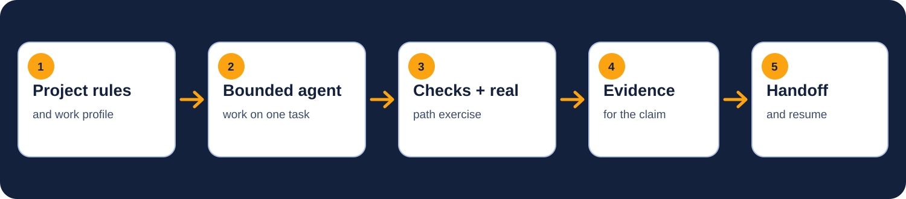

<div align="center">
  
  <p>
    <a href="https://github.com/PromptPartner/agentsmith/actions/workflows/verify.yml"></a>
    <a href="https://github.com/PromptPartner/agentsmith/releases/latest"></a>
    <a href="LICENSE"></a>
  </p>
  <p>
    <strong>English</strong> · <a href="README.de.md">Deutsch</a> · <a href="README.es.md">Español</a> · <a href="README.fr.md">Français</a> · <a href="README.zh-CN.md">简体中文</a>
  </p>
</div>

# AgentSmith

**Proof before done.** Give your AI agent project rules, a definition of done, and a way to prove the work.

AgentSmith installs a shared operating agreement and a work profile into a project. Your agent gets clear boundaries, runs the relevant checks, exercises the real path, records evidence, and leaves a handoff another session can validate. You retain control of external writes.



## Set up AgentSmith

Choose one route. Both use the same guided setup and produce the same project files.

### 1. Manual setup

1. Download the signed installer for macOS, Windows, or Linux from the [latest release](https://github.com/PromptPartner/agentsmith/releases/latest).
2. Open a terminal and run `agentsmith`.
3. Answer the guided questions. AgentSmith shows the exact plan before it writes anything.

The wizard can configure an existing project or create an empty folder and initialize Git for a new one. The standalone app includes its runtime; Python is not required.

### 2. Ask your agent

Paste this into Claude Code, Codex, or another coding agent:

```text
Install AgentSmith for this project. Follow the official agent guide at
https://github.com/PromptPartner/agentsmith/blob/master/AGENT-INSTALL.md
Inspect the project first, explain your profile recommendation in plain language,
show me the exact installation plan, and ask once before applying it.
```

The agent inspects the repository without running project code, recommends a profile from evidence, previews the managed files, installs AgentSmith, and runs the doctor check.

> Building AgentSmith from source is for contributors and advanced automation. See the [installation reference](INSTALL.md).

## New project or existing project?

| Starting point | What AgentSmith does | What it does not do |
|---|---|---|
| Existing project | Inspects the files, recommends a profile, preserves foreign content, and adds managed rules and verification scaffolding. | It does not execute the project during inspection or replace existing project configuration. |
| New project | Creates or validates an empty folder, initializes Git, and adds AgentSmith. | It does not choose or generate an application framework. Your agent can build the application after setup. |

Project setup is the default because the rules travel with the repository and can be reviewed by collaborators. A user-wide core for every project is available under **Advanced options**. A layered setup combines that user-wide core with a small project-specific profile. See [project, user-wide, and layered setups](INSTALL.md#where-the-rules-live).

## Work profiles

A profile tells the agent what “done” means for the work at hand. The wizard recommends one profile and shows the file evidence behind its choice. You can accept it or view the full list.

| Profile | Use it for | Main proof |
|---|---|---|
| `software-dev` | Features, fixes, refactors, apps, libraries, and product UI | Build, checks, tests, security pass, real invocation |
| `devops-setup` | Installers, CI, containers, configuration, and deployments | Dry run, idempotence, rollback, real deployment path |
| `marketing-outreach` | Campaigns, email, newsletters, landing copy, and CRM work | Audience and factual review, links, rendering, send approval |
| `document-creation` | Reports, proposals, specifications, manuals, and wikis | Source accuracy, structure, links, rendered file review |
| `data-crunching` | Data cleaning, analysis, SQL, metrics, and ETL | Reproducibility, totals, edge cases, output inspection |
| `general-admin` | Triage, scheduling, organization, summaries, and routine operations | Completeness, faithful output, destination and approval checks |
| `deep-research` | Due diligence, market research, and cited investigations | Source quality, claim coverage, citations, synthesis review |
| `creative-design` | Diagrams, decks, brand assets, images, and video | Brief, visual and export review, accessibility, brand consistency |
| `security-audit` | Threat models, security reviews, penetration tests, and IAM audits | Reproduction, severity evidence, remediation, retest |

`autonomous-loops` is an advanced modifier for scheduled or unattended work. Combine it with the main work profile; do not use it by itself. The [profile guide](docs/07-how-to-pick-a-profile.md) explains close calls, switching, and stacking.

## What gets installed

- `AGENTS.md` is the canonical project agreement. Claude Code also receives a generated `CLAUDE.md`.
- `.harness/verify.conf` defines the real checks for this project.
- `.agentsmith/state.json` records only AgentSmith-owned settings so updates and removal preserve foreign content.
- Optional skills, MCP servers, and hooks are available in the collapsed advanced step.

The cautious permission mode is the default. AgentSmith never treats a connected external service as permission to write to it.

## See the proof

The [First Verified Loop](docs/demos/first-verified-loop/README.md) records a failing test before the fix, passing verification afterward, a real command invocation, a receipt, and a resumable handoff. The [support registry](config/agents.json) separates instruction support from tested native behavior.

## Documentation and community

- [Installation reference](INSTALL.md)
- [Documentation map](docs/README.md)
- [How verification becomes evidence](docs/03-verify-means-evidence.md)
- [Agent compatibility](docs/22-compatibility-contract.md)
- [Contributing](CONTRIBUTING.md) and [support](SUPPORT.md)
- [Security policy](SECURITY.md) and [code of conduct](CODE_OF_CONDUCT.md)

MIT licensed. Built by [PromptPartner](https://promptpartner.ai/).
