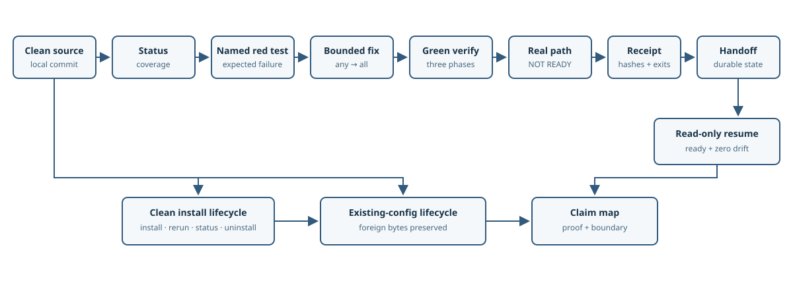

# Architecture and evidence flow

The receipt proves deterministic configured checks. The real command exercises the user-visible
path. The handoff/resume pair proves continuity without changing Git or file state. Lifecycle
fixtures prove managed ownership and preservation boundaries, not behavior of every client version.
